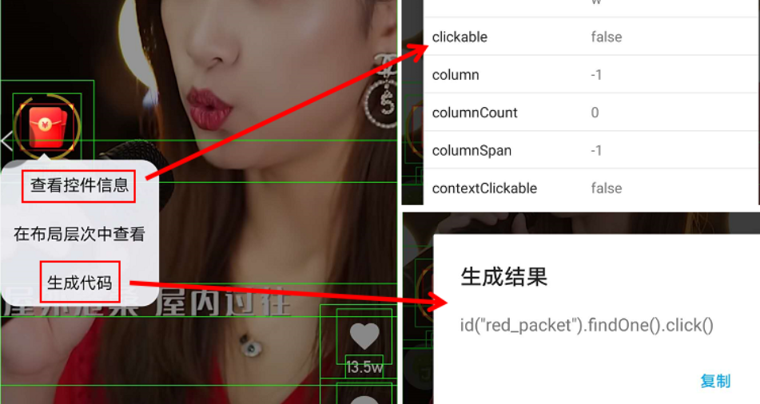

## Overview
There are many of approaches to build an automatic plugin using the web technology around the world like <a href="http://airtest.netease.com/">Airtest</a>, <a href="https://developer.chrome.com/extensions/getstarted.html">Chrome plugin</a>, <a href="https://www.w3cschool.cn/eeras_e4a/">E4A></a>, <a href="https://hyb1996.github.io/AutoJs-Docs/#/">AutoJs</a> and Native application etc. Apparently as an experienced front-end developer Autojs would be a better way to pick up for implementing mobile plugins.

## What's the Autojs?

Autojs using the Rhino 1.7.7.2 as basic engine allows you to develop your applications for Android operating system by Javascript language quite easily. It's an open resource which is located in <a href="https://github.com/hyb1996/AutoJs-Docs">Autojs GitHub</a> 

## Build your first application
As the official guide says, we can develop plugins in both Mobile and your computer. Obviously, I tend to use the Visual Studio Code to create my first project. The following topic will take you through the basic of how to implement a minimum application using your computer. If you are familiar with JavaScript or Nodejs, that would be comfortable with the journey.
> #### Download APK
In the beginning, You should download coolAn which is kind of like APP Store in https://www.coolapk.com/ so that you can get the Autojs package. I would share you an old version APK to you as well:
- URL: https://pan.baidu.com/s/1jqQXca2M35szo5bTF9V6Ug
- CODE: feil

Just install the APK in your mobile device as normal Android applications.

> #### Install Auto.js-VSCode-Extension
In VS code, you can search the "Auto.js-VSCode-Extension" in Extensions(Ctrl+Shift+X) and then install it for further debugging

##### Usage

- Pressing Ctrl+Shift+P you can run or stop Autojs conveniently.

  

- Connect your mobile device

Make sure your mobile and computer are on the LAN network. Then trigger the menu on the left side of Autojs and type IP address of you remote machine to connect. If you do this action successfully, you can see a hint like "New device attached"

  

>Build the first application

Add a javascript file called "helloWorld.js" and type in:

`toast("Hello world by AutoJS");`

Having finished all the coding, you can Press F5 to run your application in your mobile:

  

There you go, we've already built a light Autojs application. That's literally straightforward.

Also you can run "Save On device" like:

  

to store the file in your mobile and then run it directly.

  

> Features In-Depth

First and foremost, If you'd like to build sophisticated applications, you probably need to know something for debugging such as how to inspect an element, how to handle trouble-shooting etc.

Autojs provides some built-in functionality for us to catch elements you want somehow and would generate a piece of example code for developers. However one thing you're supposed to completed before starting your coding which is to ensure you've enabled these two options as below:

  

Awesome, why not just grab something on how to inspect an element and take some samples?

  

  

Alright, that's simple enough!

And next step you can open the OUTPUT panel in VS code to observe what's going on your code during the development stage.

  

Now, you can start coding and do anything you want by checking out the <a href="https://hyb1996.github.io/AutoJs-Docs/#/app">API</a> document. There are quite a few interfaces, each with its own special functionality. For here, I would give you a demonstration and put it in the repository as a reference.

  

Thanks guys!

## License

[MIT](http://opensource.org/licenses/MIT)

Copyright (c) 2020-present, Luoxiaobin
